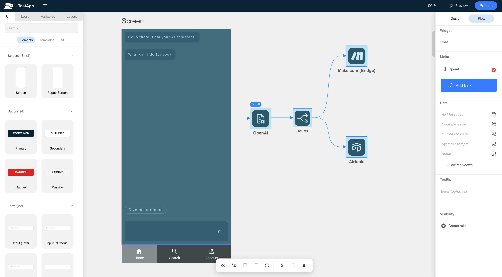

# Flowrabbit® Studio



Flowrabbit® Studio is a modern Low-Code AI platform to build UI centric GenAI workflows. The core of our platform is our infinity canvas, 
where you design user interfaces and workflows in one place.


You can try out Flowrabbit® Studio at [https://studio-os.flowrabbit.ai/#/](https://studio-os.flowrabbit.ai)

# Installation

Flowrabbit® Studio will spin up four servers, each needing their own subdomain. The easiest way to install to install 
Flowrabbit® Studio is to use the following Docker Compose file.


The docker compose file will also spin up a Traefik reverse proxy server to handle SSL. To make everything work, you need to 
update the sub domain URLs in the beginning of the file (`FLR_<app>_HOST`). Do not forget to also update the `"traefik.http.routers.<app>.rule=Host(....)"` sections below.


Also, you need to set the `FLR_CLIENT_API_KEY`, `FLR_JWT_PASSWORD`, `FLR_DB_ENCRYPTION_KEY` and `FLR_ADMIN_PASSWORD` 
to ensure data is stored securely. 


```yaml
x-common-env: &common-env
  FLR_API_URL: https://api-os.flowrabbit.ai
  FLR_APPS_URL: https://apps-os.flowrabbit.ai
  FLR_PROXY_URL: https://proxy-os.flowrabbit.ai
  FLR_NODE_URL: https://node-os.flowrabbit.ai
  FLR_HTTP_HOST: https://studio-os.flowrabbit.ai
  TZ: America/Chicago
  FLR_AUTH_SERVICE: qux
  FLR_USER_ALLOW_SIGNUP: "true"
  FLR_USER_ALLOWED_DOMAINS: "*"
  FLR_CLIENT_API_KEY: Put_Some_Secret_In_Here
  FLR_ADMIN_EMAIL: email@example.com
  FLR_ADMIN_PASSWORD: Put_Some_Secret_In_Here
  FLR_INTERNAL_API_URL: http://backend:8080
  FLR_INTERNAL_PROXY_URL: http://proxy:8084

services:
  traefik:
    image: traefik:v3.0
    command:
      # Providers
      - "--providers.docker=true"
      - "--api.dashboard=true"

      # Entrypoints
      - "--entrypoints.web.address=:80"
      - "--entrypoints.websecure.address=:443"

      # Redirect all HTTP -> HTTPS
      - "--entrypoints.web.http.redirections.entrypoint.to=websecure"
      - "--entrypoints.web.http.redirections.entrypoint.scheme=https"

      # ACME / Let's Encrypt
      - "--certificatesresolvers.myresolver.acme.email=support@flowrabbit.ai"
      - "--certificatesresolvers.myresolver.acme.storage=/letsencrypt/acme.json"
      - "--certificatesresolvers.myresolver.acme.httpchallenge=true"
      - "--certificatesresolvers.myresolver.acme.httpchallenge.entrypoint=web"
      - "--certificatesresolvers.myresolver.acme.caserver=https://acme-v02.api.letsencrypt.org/directory"

      # Request certs at startup (not just on first request)
      - "--certificatesresolvers.myresolver.acme.tlschallenge=true"
      - "--entrypoints.websecure.http.tls.certresolver=myresolver"
      - "--entrypoints.websecure.http.tls.domains[0].main=docs-os.flowrabbit.ai"


    ports:
      - "80:80"
      - "443:443"
    volumes:
      - "/var/run/docker.sock:/var/run/docker.sock:ro"
      - "./letsencrypt:/letsencrypt"

  mongo:
    restart: always
    container_name: mongo
    image: mongo
    volumes:
      - ./mongo-data:/data/db        # pth for the data to be stored and kept on your host machine is on the left side of the ":"
  backend:
    restart: always
    container_name: backend
    image: flowrabbit/backend:latest
    volumes:
      - ./app-data:/app-data
    environment:
      <<: *common-env
      FLR_HTTP_PORT: 8080
      FLR_MONGO_DB_NAME: quantux
      FLR_MONGO_TABLE_PREFIX: quantux
      FLR_MONGO_CONNECTION_STRING: mongodb://mongo:27017
      FLR_MAIL_USER: 
      FLR_MAIL_PASSWORD: 
      FLR_MAIL_HOST: 
      FLR_DB_ENCRYPTION_KEY: some-long-string-of-mix-case-chars-and-nums
      FLR_JWT_PASSWORD: some-long-string-of-mix-case-chars-and-nums
      FLR_IMAGE_FOLDER_USER: /app-data/qux-images
      FLR_IMAGE_FOLDER_APPS: /app-data/qux-image-apps 
    depends_on:
      - mongo
    labels:
      - "traefik.enable=true"
      - "traefik.http.routers.api.rule=Host(`api-os.flowrabbit.ai`)" # update here
      - "traefik.http.routers.api.entrypoints=websecure"
      - "traefik.http.routers.api.tls.certresolver=myresolver"
      - "traefik.http.services.api.loadbalancer.server.port=8080"
  studio:
    restart: always
    container_name: studio
    image: flowrabbit/studio:latest
    environment:
        <<: *common-env
    labels:
      - "traefik.enable=true"
      - "traefik.http.routers.studio.rule=Host(`studio-os.flowrabbit.ai`)" # update here
      - "traefik.http.routers.studio.entrypoints=websecure"
      - "traefik.http.routers.studio.tls.certresolver=myresolver"
      - "traefik.http.services.studio.loadbalancer.server.port=8082"
  proxy:
    restart: always
    container_name: proxy
    image: flowrabbit/proxy:latest
    environment:
        <<: *common-env
    labels:
      - "traefik.enable=true"
      - "traefik.http.routers.proxy.rule=Host(`proxy-os.flowrabbit.ai`)" #update here
      - "traefik.http.routers.proxy.entrypoints=websecure"
      - "traefik.http.routers.proxy.tls.certresolver=myresolver"
      - "traefik.http.services.proxy.loadbalancer.server.port=8084"
  apps:
    restart: always
    container_name: apps
    image: flowrabbit/apps:latest
    environment:
        <<: *common-env
    labels:
      - "traefik.enable=true"
      - "traefik.http.routers.apps.rule=Host(`apps-os.flowrabbit.ai`)" #update here
      - "traefik.http.routers.apps.entrypoints=websecure"
      - "traefik.http.routers.apps.tls.certresolver=myresolver"
      - "traefik.http.services.apps.loadbalancer.server.port=8083"
  docs:
    restart: always
    container_name: docs
    image: flowrabbit/docs:latest
    environment:
        <<: *common-env
    labels:
      - "traefik.enable=true"
      - "traefik.http.routers.docs.rule=Host(`docs-os.flowrabbit.ai`)" #update here
      - "traefik.http.routers.docs.entrypoints=websecure"
      - "traefik.http.routers.docs.tls.certresolver=myresolver"
      - "traefik.http.services.docs.loadbalancer.server.port=8085"
```


# Dev Setup

## Main Modules

- studio: The Flowrabbit® studio (based on Quant-UX)
- backend: The Flowrabbit® backend (based on Quant-UX)

## Helper Modules

- proxy: Proxy server to access certain APIs and handle secrets
- docs: PDF and Audio processor
- apps: Responsive Viewer for flowrabbit apps (based on Luisa.could)
- websockey: Websockert server for realtime collaboration
